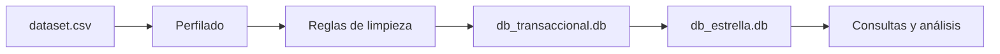
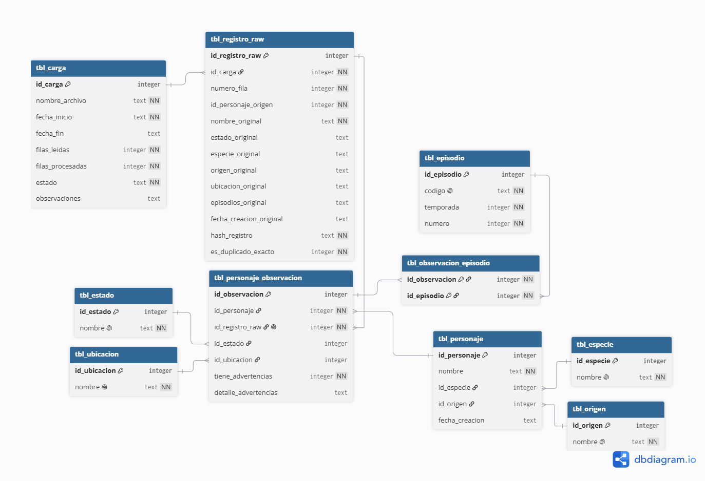
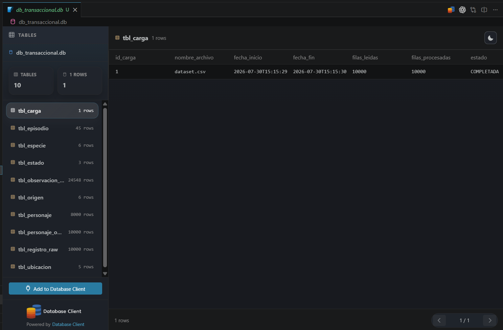
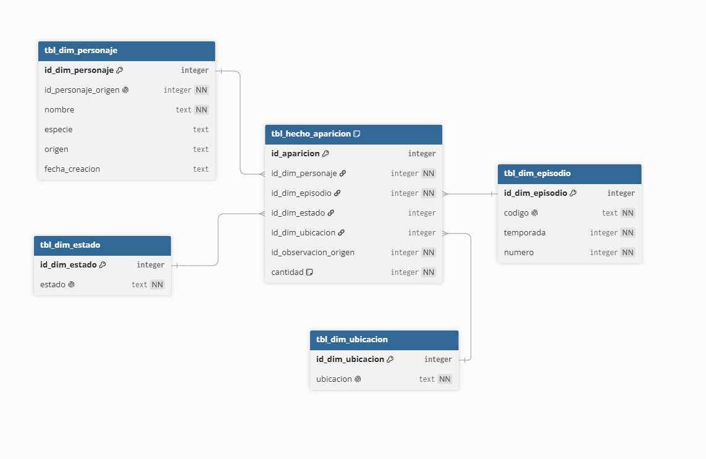
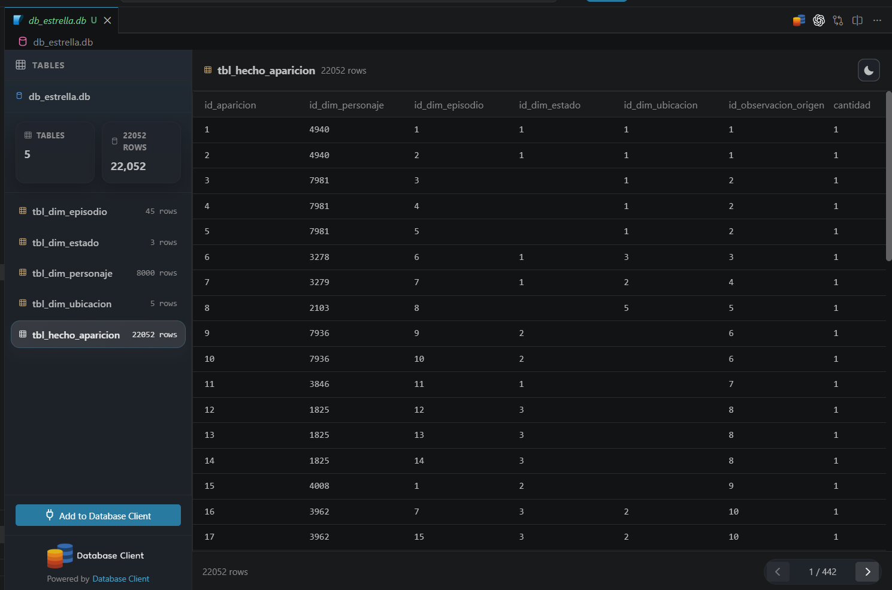
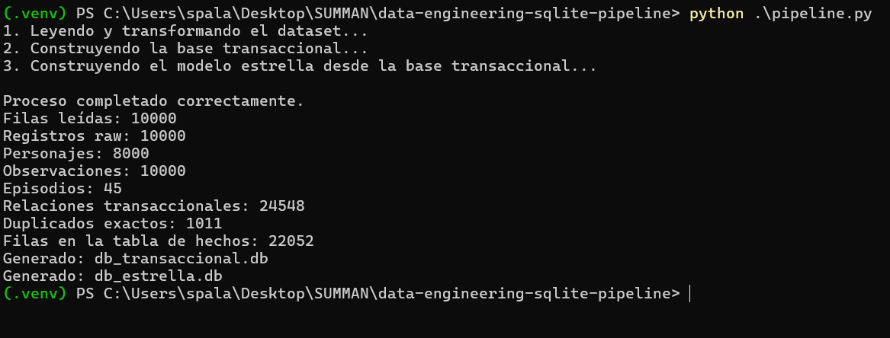

# Justificación de la solución

**Autor:** Santiago Palacio Cárdenas

## 1. Contexto

La prueba técnica entregó tres elementos principales:

- Un archivo `dataset.csv` con 10.000 registros.
- Un archivo `pipeline.py` incompleto.
- Un `README.md` con la solicitud de construir una base transaccional y, a partir de ella, un modelo estrella en SQLite.

La solución se desarrolló como un proceso batch local con Python y SQLite. La intención no fue construir una arquitectura innecesariamente grande, sino resolver correctamente el problema con herramientas fáciles de ejecutar, revisar y explicar.

El flujo final quedó así:



## 2. Revisión del código original

Antes de modificar el script se ejecutó tal como fue recibido. La primera falla fue:

```text
NameError: name 'csv_path' is not defined
```

También se encontraron otros problemas:

- La ruta del CSV no estaba definida.
- El código buscaba la columna `state`, pero el archivo contiene `estado`.
- La sentencia usaba `INSERT INT` en lugar de `INSERT INTO`.
- Se creaba una sola tabla genérica llamada `tabla`.
- Todos los campos se almacenaban como texto.
- No había claves primarias, claves foráneas, restricciones ni índices.
- No existían validaciones de calidad.
- No se construía el modelo transaccional solicitado.
- No se generaba el modelo estrella.
- No había una estrategia para los duplicados ni para los valores inconsistentes.

El uso de parámetros en `cursor.execute()` sí era una buena decisión del código original, porque evita formar consultas SQL mediante concatenación de texto.

## 3. Perfilado inicial

Antes de decidir cómo limpiar o modelar la información se creó `perfil_dataset.py`. Su propósito fue conocer el estado real del archivo sin modificarlo.

El informe quedó almacenado en:

```text
resultados/perfil_datos.json
```

Los principales resultados fueron:

| Hallazgo | Resultado |
|---|---:|
| Filas | 10.000 |
| Columnas | 8 |
| IDs distintos | 8.000 |
| IDs repetidos | 1.766 |
| Filas adicionales por IDs repetidos | 2.000 |
| Duplicados exactos adicionales | 1.011 |
| IDs repetidos con información diferente | 928 |
| Episodios distintos | 45 |

También se encontraron valores ausentes representados de varias maneras, diferencias de mayúsculas y espacios, entidades HTML, algunos textos dañados y fechas con formatos distintos.

La columna `episodios` venía en cuatro presentaciones:

- Un episodio individual.
- Valores separados por coma.
- Valores separados por `|`.
- Listas con sintaxis de Python.

Hacer este perfilado primero permitió que las reglas de transformación se basaran en lo que realmente contenía el archivo y no en suposiciones.

## 4. Decisiones de limpieza

Las transformaciones se mantuvieron simples y explícitas.

### Textos

Se eliminaron espacios sobrantes y se decodificaron entidades HTML, por ejemplo:

```text
Citadel of Ricks &amp; Mortys
```

se convirtió en:

```text
Citadel of Ricks & Mortys
```

También se normalizaron nombres y categorías cuando existía una equivalencia clara. La limpieza de caracteres dañados fue limitada para no modificar valores de forma agresiva.

### Valores ausentes

Se trataron como ausencia de dato los siguientes marcadores:

```text
cadena vacía
N/A
NULL
None
---
???
```

Cuando correspondía, estos valores se almacenaron como `NULL`.

Se mantuvo la diferencia entre un valor conocido llamado `Unknown` y un dato realmente ausente.

### Fechas

Las fechas válidas se llevaron al formato:

```text
YYYY-MM-DD
```

Se reconocieron fechas ISO, timestamps ISO, `DD/MM/YYYY` y `MM-DD-YYYY`. Los textos inválidos no se reemplazaron por fechas inventadas; se conservaron en la capa raw y su versión normalizada quedó como `NULL`.

### Episodios

Los distintos formatos se convirtieron en una lista uniforme. Cada código fue validado con el patrón:

```text
SddEdd
```

Los episodios repetidos dentro de una misma fila se conservaron una sola vez en la relación normalizada.

### Duplicados

Cada fila se representó mediante un hash SHA-256 calculado con sus valores originales.

La primera aparición se conserva como referencia y las apariciones posteriores con el mismo hash se marcan como duplicados exactos. Estos registros no se eliminan de la base transaccional; permanecen disponibles para trazabilidad.

## 5. Diseño de la base transaccional

La base transaccional no se planteó como una sola tabla plana. Se separaron las responsabilidades para conservar el dato original, evitar repeticiones innecesarias y representar correctamente las relaciones.



### Control de la carga

`tbl_carga` registra:

- Archivo procesado.
- Fecha inicial y final.
- Filas leídas.
- Filas procesadas.
- Estado de la ejecución.
- Observaciones.

Esto permite comprobar que la carga terminó y conocer cuántos registros fueron procesados.

### Capa original

`tbl_registro_raw` conserva las 10.000 filas tal como llegaron en el CSV. Incluye:

- Número de fila.
- Valores originales.
- Hash del registro.
- Indicador de duplicado exacto.
- Referencia a la carga.

Esta tabla es la principal evidencia de linaje: permite rastrear el dato normalizado hasta el archivo original.

### Catálogos

Se crearon:

- `tbl_especie`
- `tbl_origen`
- `tbl_estado`
- `tbl_ubicacion`

Estas tablas evitan repetir miles de veces los mismos valores normalizados y permiten controlar mejor las categorías disponibles.

### Personajes y observaciones

`tbl_personaje` contiene una fila por identificador de personaje, con sus atributos más estables.

`tbl_personaje_observacion` contiene una fila por registro recibido y enlaza:

- El personaje.
- El registro original.
- El estado observado.
- La ubicación observada.
- Las advertencias de calidad.

Esta separación fue necesaria porque existen 8.000 IDs, pero 10.000 filas. Además, 928 IDs repetidos tienen información diferente.

No se eligió automáticamente “la última fila” como correcta porque el dataset no incluye fecha de actualización ni número de versión.

### Episodios

`tbl_episodio` almacena los 45 episodios distintos.

`tbl_observacion_episodio` resuelve la relación muchos a muchos entre observaciones y episodios.

La base transaccional terminó con 24.548 relaciones observación–episodio.

### Evidencia de la carga



La captura muestra las diez tablas y el registro de `tbl_carga`, donde se confirma que `dataset.csv` fue procesado con 10.000 filas leídas, 10.000 procesadas y estado `COMPLETADA`.

## 6. Diseño del modelo estrella

La segunda base se genera leyendo exclusivamente `db_transaccional.db`.

Esta decisión separa dos responsabilidades:

- La base transaccional conserva y organiza el dato.
- La base estrella facilita consultas y agregaciones.



El grano de `tbl_hecho_aparicion` es:

> Una observación de un personaje asociada a un episodio.

Se crearon las siguientes dimensiones:

- `tbl_dim_personaje`
- `tbl_dim_episodio`
- `tbl_dim_estado`
- `tbl_dim_ubicacion`

La tabla `tbl_hecho_aparicion` contiene las claves de esas dimensiones, la referencia a la observación transaccional y una medida `cantidad` con valor `1`.

Esta estructura permite responder preguntas como:

- ¿Cuántas apariciones tiene cada personaje?
- ¿Qué episodios concentran más registros?
- ¿Cuántas apariciones existen por estado?
- ¿Cómo se distribuyen las apariciones por ubicación?

### Tratamiento de duplicados en el modelo analítico

La base transaccional conserva todas las filas, incluidos los duplicados exactos.

En cambio, el modelo estrella excluye esas copias para evitar contar varias veces la misma observación analítica.

Por eso los resultados son distintos:

```text
24.548 relaciones en la base transaccional
22.052 filas en la tabla de hechos
```

La diferencia corresponde a las relaciones asociadas con filas marcadas como duplicados exactos.

### Evidencia del modelo estrella



La captura muestra las cinco tablas y las 22.052 filas de `tbl_hecho_aparicion`.

## 7. Construcción segura de los archivos SQLite

Para reducir el riesgo de dejar archivos finales incompletos, las bases se construyen primero con nombres temporales:

```text
db_transaccional.tmp.db
db_estrella.tmp.db
```

Solo después de completar las inserciones y validaciones se reemplazan los archivos finales.

Las conexiones se cierran explícitamente antes de renombrar los archivos. Esto fue necesario porque Windows bloquea un archivo SQLite mientras otra conexión lo mantiene abierto.

Este mecanismo también ayuda a evitar que una ejecución fallida deje como resultado una base final incompleta.

## 8. Validaciones

El perfilador y el pipeline comprueban:

- Existencia del CSV.
- Encabezado esperado.
- Cantidad de filas y columnas.
- Valores vacíos y equivalentes a nulo.
- Identificadores repetidos.
- Duplicados exactos.
- Formatos de fechas.
- Formatos y códigos de episodios.
- Conservación de las 10.000 filas en `tbl_registro_raw`.
- Conservación de las 10.000 observaciones.
- Integridad de claves foráneas.
- Integridad general de los archivos SQLite.
- Correspondencia entre la base transaccional y la tabla de hechos.

Las dos bases produjeron:

```text
PRAGMA integrity_check = ok
PRAGMA foreign_key_check = []
```

La ejecución final produjo:

| Validación | Resultado |
|---|---:|
| Filas leídas | 10.000 |
| Registros raw | 10.000 |
| Personajes | 8.000 |
| Observaciones | 10.000 |
| Episodios | 45 |
| Relaciones transaccionales | 24.548 |
| Duplicados exactos | 1.011 |
| Filas de hechos | 22.052 |



## 9. Supuestos y limitaciones

### Registros repetidos

No existe una columna de actualización que permita ordenar las distintas versiones de un mismo personaje. Por esta razón, las observaciones se conservaron en lugar de sobrescribir información.

### Valores faltantes

No se imputaron valores ni se intentó adivinar información ausente. Los datos que no podían interpretarse con seguridad se almacenaron como `NULL` en la capa normalizada.

### Fechas ambiguas

Los formatos se interpretaron de acuerdo con los patrones observados en el archivo. Los valores explícitamente inválidos quedaron como nulos en la versión limpia.

### Alcance

La solución está pensada para una prueba local y un archivo de 10.000 registros. No se añadieron tecnologías como Spark, Airflow, Docker o servicios en la nube porque no eran necesarias para resolver este volumen ni los requisitos entregados.

## 10. Mejoras para una versión productiva

En una versión productiva consideraría:

- Pruebas unitarias para las funciones de normalización.
- Pruebas de integración para ambas bases.
- Logging estructurado.
- Reglas de calidad configurables.
- Procesamiento por lotes o incremental para archivos más grandes.
- Control formal de versiones del esquema.
- Métricas y alertas de ejecución.
- Separación entre ambientes.
- Automatización mediante integración continua.

Estas mejoras no se incluyeron porque el objetivo principal era entregar una solución funcional, clara y proporcional al ejercicio.

## 11. Conclusión

La solución transforma un archivo con inconsistencias en dos bases con propósitos diferentes:

- `db_transaccional.db` conserva el origen, el linaje y las observaciones recibidas.
- `db_estrella.db` organiza la información para consultas analíticas.

Las decisiones principales fueron conservar la trazabilidad, no inventar versiones de los datos, separar correctamente las relaciones y evitar que los duplicados exactos distorsionaran el modelo analítico.

El resultado final es reproducible, puede ejecutarse con un solo comando y utiliza únicamente Python y SQLite, sin dependencias externas.
