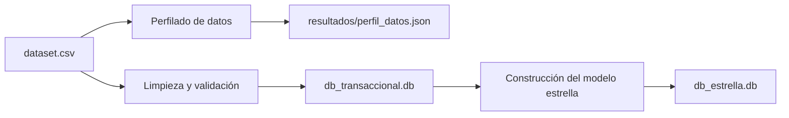

# Pipeline de ingeniería de datos con SQLite

**Autor:** Santiago Palacio Cárdenas

Este proyecto corresponde a una prueba técnica de ingeniería de datos. El punto de partida fue un archivo CSV con 10.000 registros y un script incompleto que intentaba insertar la información directamente en una tabla SQLite.

La solución final organiza el proceso en dos etapas:

1. Limpia, valida y carga los datos en una base transaccional.
2. Construye, a partir de esa base, un modelo estrella orientado a análisis.

El desarrollo se mantuvo intencionalmente sencillo: Python, SQLite y módulos incluidos en la instalación estándar. La prioridad fue entregar una solución clara, reproducible y fácil de explicar.

---

## Flujo de la solución



La base estrella no se genera directamente desde el CSV. Primero se construye y valida la base transaccional, y después se utiliza como fuente para el modelo analítico.

---

## Resultados obtenidos

| Resultado | Cantidad |
|---|---:|
| Filas leídas del CSV | 10.000 |
| Registros conservados en la capa raw | 10.000 |
| Personajes distintos | 8.000 |
| Observaciones conservadas | 10.000 |
| Episodios distintos | 45 |
| Relaciones observación–episodio | 24.548 |
| Duplicados exactos detectados | 1.011 |
| Filas en la tabla de hechos | 22.052 |

Los duplicados exactos se conservan en la base transaccional para mantener trazabilidad, pero no se incluyen en la tabla de hechos para evitar que los resultados analíticos queden inflados.

---

## Estructura del repositorio

```text
data-engineering-sqlite-pipeline/
├── .gitignore
├── README.md
├── JUSTIFICACION.md
├── dataset.csv
├── pipeline.py
├── perfil_dataset.py
├── db_transaccional.db
├── db_estrella.db
├── resultados/
│   └── perfil_datos.json
└── docs/
    ├── modelo_transaccional.dbml
    ├── modelo_estrella.dbml
    ├── Modelo_Transaccional.pdf
    ├── Modelo_Estrella.pdf
    └── img/
        ├── base_transaccional.png
        ├── base_estrella.png
        ├── ejecucion_pipeline.png
        ├── modelo_transaccional.png
        └── modelo_estrella.png
```

---

## Requisitos

- Python 3.9 o superior.
- Git.
- Un editor como Visual Studio Code o PyCharm.
- Opcionalmente, una extensión o aplicación para visualizar archivos SQLite.

No se requieren librerías externas. El proyecto utiliza únicamente módulos incluidos con Python, como `csv`, `sqlite3`, `datetime`, `hashlib`, `json`, `html`, `re` y `pathlib`.

---

## Cómo ejecutar el proyecto

### 1. Clonar el repositorio

```powershell
git clone https://github.com/spalacioc05/data-engineering-sqlite-pipeline.git
cd data-engineering-sqlite-pipeline
```

### 2. Crear el entorno virtual

```powershell
python -m venv .venv
```

### 3. Activar el entorno en PowerShell

```powershell
.\.venv\Scripts\Activate.ps1
```

Cuando el entorno esté activo, la consola mostrará `(.venv)` al inicio de la línea.

### 4. Ejecutar el perfilado de datos

```powershell
python .\perfil_dataset.py
```

Este paso no modifica el dataset. Genera el archivo:

```text
resultados/perfil_datos.json
```

Allí se registran conteos de nulos, duplicados, identificadores repetidos, formatos de episodios, formatos de fecha y otras observaciones de calidad.

### 5. Ejecutar el pipeline principal

```powershell
python .\pipeline.py
```

La ejecución genera o reemplaza:

```text
db_transaccional.db
db_estrella.db
```

Salida esperada:

```text
1. Leyendo y transformando el dataset...
2. Construyendo la base transaccional...
3. Construyendo el modelo estrella desde la base transaccional...

Proceso completado correctamente.
Filas leídas: 10000
Registros raw: 10000
Personajes: 8000
Observaciones: 10000
Episodios: 45
Relaciones transaccionales: 24548
Duplicados exactos: 1011
Filas en la tabla de hechos: 22052
Generado: db_transaccional.db
Generado: db_estrella.db
```


---

## Perfilado y calidad de los datos

Antes de diseñar las bases se revisó el contenido del CSV. Los principales hallazgos fueron:

- 10.000 filas y 8.000 identificadores distintos.
- 1.766 identificadores repetidos.
- 1.011 duplicados exactos adicionales.
- Valores ausentes representados de distintas formas: `N/A`, `NULL`, `None`, `---`, `???` y cadenas vacías.
- Variaciones de mayúsculas, espacios y algunos caracteres dañados.
- Fechas almacenadas en varios formatos.
- Episodios representados como valor individual, lista, texto separado por coma o texto separado por `|`.

Estas diferencias se trataron mediante reglas simples y explícitas. Cuando un valor no podía interpretarse de forma segura, se conservó el dato original en la capa raw y el valor normalizado quedó como `NULL`.

---

## Base de datos transaccional

La base `db_transaccional.db` conserva el dato original y, al mismo tiempo, organiza la información normalizada.


Las tablas se agrupan de la siguiente manera:

- **Control de ejecución:** `tbl_carga`.
- **Trazabilidad del archivo original:** `tbl_registro_raw`.
- **Catálogos normalizados:** `tbl_especie`, `tbl_origen`, `tbl_estado` y `tbl_ubicacion`.
- **Entidad principal:** `tbl_personaje`.
- **Observaciones recibidas:** `tbl_personaje_observacion`.
- **Episodios:** `tbl_episodio`.
- **Relación muchos a muchos:** `tbl_observacion_episodio`.

La separación entre personaje y observación evita asumir que la última fila de un ID repetido es necesariamente la versión correcta. El dataset no contiene una fecha de actualización que permita tomar esa decisión con seguridad.

---

## Modelo estrella

La base `db_estrella.db` se construye exclusivamente desde la base transaccional.


El grano de `tbl_hecho_aparicion` es:

> Una observación de un personaje asociada a un episodio.

La tabla de hechos se relaciona con:

- `tbl_dim_personaje`
- `tbl_dim_episodio`
- `tbl_dim_estado`
- `tbl_dim_ubicacion`

El campo `cantidad` tiene valor `1` y permite realizar agregaciones sencillas, por ejemplo:

- Apariciones por personaje.
- Apariciones por episodio.
- Apariciones por estado.
- Apariciones por ubicación.
- Cantidad de personajes relacionados con cada episodio.

### Vista de las bases generadas

La base transaccional registra la ejecución y conserva los 10.000 registros originales:


La base estrella contiene las dimensiones y las 22.052 filas de `tbl_hecho_aparicion`:


---

## Validaciones realizadas

El pipeline comprueba:

- Existencia del archivo CSV.
- Correspondencia del encabezado esperado.
- Conversión válida de identificadores.
- Formato de episodios.
- Integridad de claves foráneas.
- Integridad general de cada base SQLite.
- Conservación de las 10.000 filas en la capa raw.
- Conservación de las 10.000 observaciones.
- Correspondencia entre el origen transaccional y la tabla de hechos.

Las dos bases terminaron con:

```text
PRAGMA integrity_check = ok
PRAGMA foreign_key_check = []
```

---

## Documentación adicional

La explicación detallada de las decisiones, transformaciones, supuestos y dificultades está disponible en:

[JUSTIFICACION.md](JUSTIFICACION.md)

Los modelos también se encuentran en formato DBML y PDF dentro de la carpeta `docs`.


